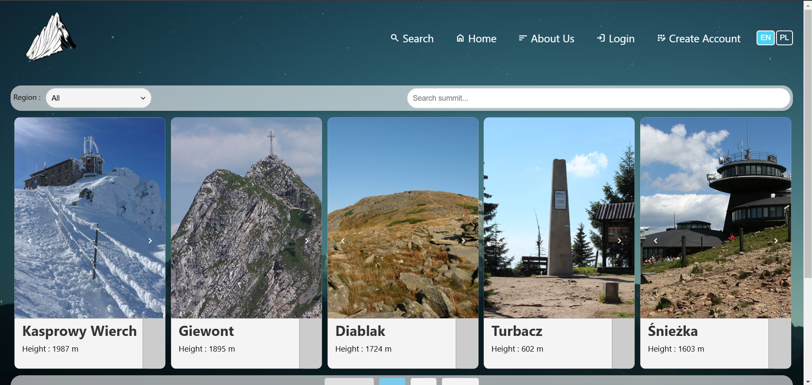
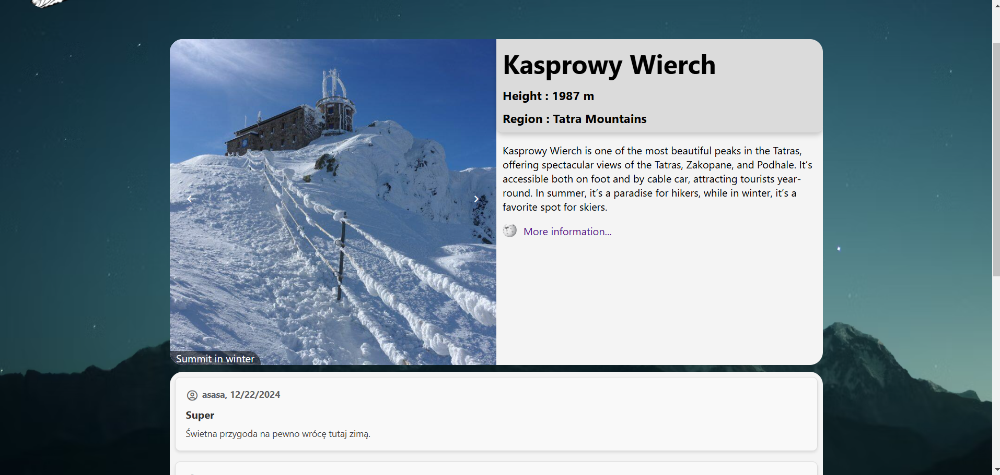

# Aplikacja Frontendowa - Biblioteka Szczytów Polskich Gór

Projekt semestralny z przedmiotu **Technologie Internetowe (TIN)**.

## Opis
Aplikacja frontendowa stworzona w frameworku React, będąca częścią projektu semestralnego. Celem projektu jest stworzenie dynamicznej aplikacji SPA (Single Page Application) dla **Biblioteki Szczytów Polskich Gór**. Aplikacja umożliwia przeglądanie, wyszukiwanie i zarządzanie danymi o najwyższych szczytach górskich w Polsce. Została zaprojektowana z wykorzystaniem nowoczesnych technologii frontendowych oraz integracji z aplikacją backendową opartą na REST API.

## Funkcjonalności
  - Interaktywne UI umożliwiające zarządzanie zasobami (szczyty górskie, regiony, komentarze).
  - Integracja z backendem za pomocą zapytań REST API w celu pobierania i zarządzania danymi.
  - Obsługa użytkowników (rejestracja, logowanie).
  - Wykorzystanie React Router do nawigacji między widokami.
  - Walidacja formularzy (np. podczas dodawania nowych szczytów, regionów, komentarzy).
  - Tłumaczenia aplikacji z użyciem i18n.
  - Obsługa paginacji za pomocą `react-paginate` dla długich list szczytów.

## Wymagania
- Node.js (preferowana wersja 16.x lub wyższa).
- npm lub yarn.
- Przeglądarka internetowa wspierająca nowoczesne technologie (np. Chrome, Firefox, Edge).

## Instalacja
1. Sklonuj repozytorium:
   ```bash
   git clone https://github.com/PawelSzeliga23/TIN_projekt_frontend.git



